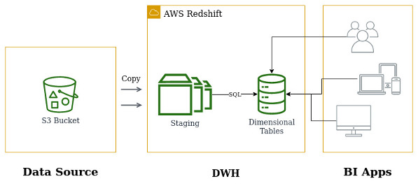
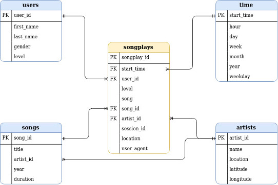

# About the project

This repo contains third capstone project for **Udacity Data Engeneering Nanodegree** program (here is the project [frontpage](https://www.udacity.com/course/data-engineer-nanodegree--nd027)).\
The goal is to implement a DWH using `Amazon Redshift` service, and a ETL pipeline that extracts data from S3 bucket, and loads it into normalized (`3NF`) data model.

The project revolves around imaginary music streeming company - **Sparkify**.\
They store JSON logs of users activitiy in S3 bucket, along with metadata on songs played.\
We are to enable this data for easy analytical queries. This is achieved by implementing a ETL pipeline that loads the data into staging tables in a Redshift cluster, and transforms it into dimesional tables.

## Repo structure

**/functions** stores main project functions:
* `setup_aws.py` creates a instance of Redshift cluster,
* `create_tables.py` creates both staging and dimesional tables,
* `etl.py` copies the data from S3 into staging tables, and loads the data from staging into final data model.

**/confings**:
* contains the cluster and dwh specifications `aws.cfg`
* for proper execution this folder should also contain `iam.cfg` with credentials neccesary for cluster creation (see details in _Running this project_ section below).

**/samples**:
* contain samples of users activity log data `2018-11-01-events.json` and 
* song metadata `TRAAAAK128F9318786.json`
* `log_json_path.json` is the definition of log structure, allowing for proper copy from `S3`.

## Running this project

As mentioned above a IAM credentials are required for sucessful project execution. The config should contain KEY and SECRET under IAM section:
```
[IAM]
KEY = 
SECRET = 
```

The user needs policies that allow to handle Redshift cluster **AmazonRedshiftFullAccess**.\
Also a policy allowing to pass `S3` access to the cluster **AmazonS3ReadOnlyAccess** is required. Such policy can be defined as such:
```json
{
    "Version": "2012-10-17",
    "Statement": [
        {
            "Effect": "Allow",
            "Action": [
                "iam:GetRole",
                "iam:PassRole"
            ],
            "Resource": "arn:aws:iam::xxxxxxxxxxxx:role/Redshift_RO"
        }
    ]
}
```
Where `Resource` is a `arn` of your role providing `S3` access.\
More on IAM user and policies can be found [here](https://aws.amazon.com/iam/) and [here](https://docs.aws.amazon.com/IAM/latest/UserGuide/access_policies.html).

When `IAM.cfg` is provided, then the `test.ipynb` runs through all stages of the project:
1) first a Redshift cluster is created,
2) then a `TCP` port is opened allowing for access to the cluster endpoint,
3) finally `ETL` is run, creatning staging tables, copying the data form `S3` and populating analytical data model,
4) now analytical queries can be run,
5) when done with queries don't forget to cleanup the resources to avoid extra charges from Amazon.

# Redshift and ETL

## Architecture

Solution architecture can be summarised in below diagram. \
There are two main components: 
* **Data sources** - raw data in JSON format
* **DWH** - where staging area and main dwh resides\
 Analytical data model can be accesed by external **BI apps** via database endpoint.



## Data model

As the goal is to enable Sparkify analysts an easy and flexible way of quering the data, the **snowflake** logical architecture has been choosen.
Main **facts** relation is `songplays`.
**Dimesion** tables will cover:
* `song`
* `artist`
* `user`
* `time`

metadata. This model will provide logical separation of different business entities and limit the data redundancy. Those properties make our database design achieve `3NF`.



# Sample queries

Lets run some sample queries to get basic insigts about the Sparkify business.

a) top 10 most played songs

```sql
SELECT
    songs.title AS song,
    artists.name AS artist
FROM songplays 
    JOIN songs ON songplays.song_id = songs.song_id
    JOIN artists ON songplays.artist_id = artists.artist_id
GROUP BY 1, 2
ORDER BY count(*) DESC
LIMIT 10;

place	song	        plays
1	    You're The One	37
2	    Undo	        28
3	    Revelry	        27
4	    Sehr kosmisch	21
5	    Horn Concerto No. 4 in E flat K495: II. Romance (Andante cantabile)	            19
6	    Secrets	        17
7	    Canada	        17
8	    Dog Days Are Over (Radio Edit)	16
9	    Fireflies	    14
10	    Représente	14
```

_You're The One_ is the most played song, however there is no outstanding hit song.


b) number of songs played by a weekday

```sql
SELECT 
    weekday, 
    COUNT(*) AS plays 
FROM songplays 
    JOIN time USING(start_time) 
GROUP BY
    1
ORDER BY
    1
;

weekday	plays
1	     1014
2	     1071
3	     1364
4	     1052
5	     1295
6	      628
7	      396
```
It can be seen that Wendesday is the day when the app is used the most. Sumprisingly users choose different acivities during the weekend.

